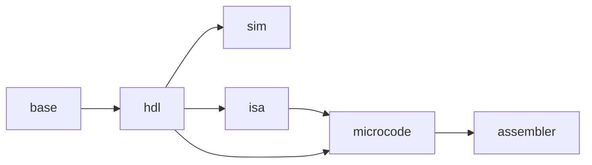
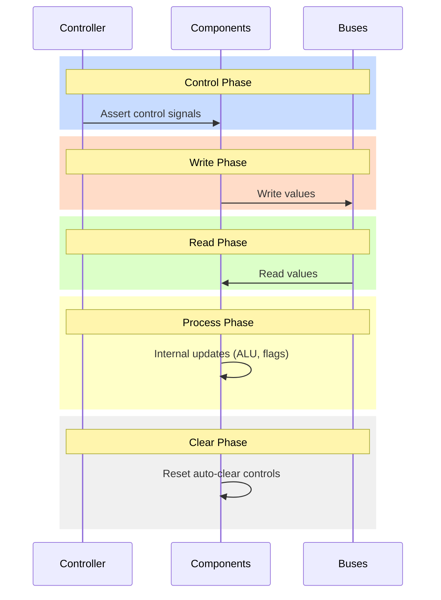
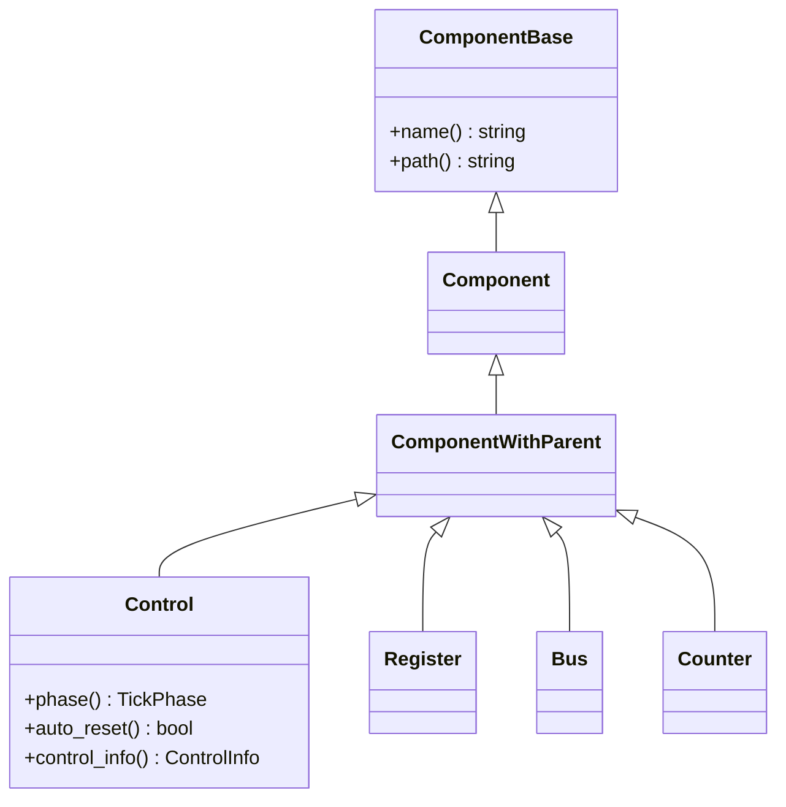
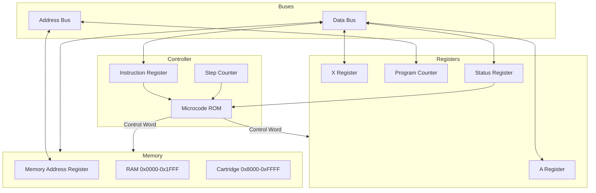

# IRATA2 Code Review Report

**Date**: 2026-01-10
**Scope**: Full codebase review against stated design goals
**Reviewer**: Automated code review

---

## Executive Summary

The IRATA2 codebase demonstrates **excellent adherence to design principles** with a solid foundation for a hardware-ish CPU simulator. All issues from the previous review are now resolved. Documentation generation infrastructure has been added.

### Summary Metrics

| Category | Status |
|----------|--------|
| Major Issues | 0 |
| Minor Issues | 0 |
| Design Compliance | ~98% |
| Test Coverage | 191 tests passing |
| Module Separation | Excellent |

---

## Design Goal Compliance Matrix

| Design Goal | Status | Notes |
|-------------|--------|-------|
| Hardware-ish design | PASS | Phase validation enforced in sim controls |
| CRTP for zero-cost dispatch | PASS | ControlInfo replaces ControlBase virtuals |
| Immutable HDL structure | PASS | All HDL members are const |
| Strongly typed navigation | PASS | Path resolution moved to microcode |
| Type-safe Byte/Word | PASS | Properly used throughout |
| Five-phase tick model | PASS | Phase validation enforced in sim controls |
| 100% test coverage | PARTIAL | 191 tests passing, high coverage |
| Clean module boundaries | PASS | Excellent separation of concerns |
| No instruction logic in components | PASS | Components are dumb hardware |

---

## Resolved Issues (Previously Major)

### Issue 1: ControlBase Virtual Dispatch (RESOLVED)

ControlBase with virtual dispatch is gone. The HDL now uses pure CRTP:

```cpp
template <typename Derived, typename ValueType, base::TickPhase Phase, bool AutoReset>
class Control : public ComponentWithParent<Derived>, public ControlTag {
  const ControlInfo& control_info() const { return control_info_; }
  static constexpr base::TickPhase phase() { return Phase; }
  static constexpr bool auto_reset() { return AutoReset; }
};
```

ControlInfo is a non-virtual POD-like struct:
```cpp
struct ControlInfo {
  base::TickPhase phase;
  bool auto_reset;
  std::string_view path;
};
```

### Issue 2: Mutable Caches in HDL (RESOLVED)

All HDL members are now `const`. The Cpu is truly immutable with a thread-safe singleton:
```cpp
const Cpu& GetCpu() {
  static const Cpu instance;
  return instance;
}
```

### Issue 3: Missing Phase Validation (RESOLVED)

Phase validation is enforced on all control operations:
```cpp
bool asserted() const {
  EnsurePhase(phase_, "read");
  return asserted_;
}

void Set(bool asserted) {
  EnsurePhase(base::TickPhase::Control, "set");
  asserted_ = asserted;
}
```

### Issue 4: String-Based Path Resolution (RESOLVED)

String path resolution now lives in `microcode::ir::CpuPathResolver`, separate from HDL.
HDL Cpu exposes only strongly typed accessors.

### Issue 5: Simulator Mutable Cache Pattern (RESOLVED)

Control indexing is built once during CPU construction. No lazy initialization.

### Issue 6: Bus Read-After-Write (RESOLVED)

Bus explicitly tracks writes per tick:
```cpp
bool wrote_this_tick_ = false;

void Write(ValueType value, std::string_view writer_path) {
  if (wrote_this_tick_) {
    throw SimError("bus already written: " + path());
  }
  wrote_this_tick_ = true;
  // ...
}

ValueType Read(std::string_view reader_path) const {
  if (!wrote_this_tick_) {
    throw SimError("bus read before write: " + reader_path);
  }
  // ...
}
```

### Issue 7: Controller Control Targets (RESOLVED)

Controller stores controls in HDL traversal order and asserts them from control words like a ROM:
```cpp
void Controller::AssertControlWord(uint64_t control_word) {
  for (size_t i = 0; i < control_lines_.size(); ++i) {
    if ((control_word >> i) & 1U) {
      control_lines_[i]->Assert();
    }
  }
}
```

---

## Remaining Minor Issues

### Issue 1: Unnecessary const_cast Usage (RESOLVED)

**Location**: [sim/src/controller.cpp:53](sim/src/controller.cpp#L53), [sim/src/cpu.cpp:135-136](sim/src/cpu.cpp#L135-L136)
**Severity**: LOW
**Status**: RESOLVED

Two locations use `const_cast` that can be eliminated:

#### 1a. Controller uses `const auto*` unnecessarily

```cpp
// Current (controller.cpp:47-53)
for (size_t i = 0; i < control_order.size(); ++i) {
  const auto* control = control_order[i];  // Forces const, then casts away
  // ...
  control_lines_.push_back(const_cast<ControlBase*>(control));
}
```

**Fix**: Use `auto*` instead of `const auto*`:
```cpp
for (size_t i = 0; i < control_order.size(); ++i) {
  auto* control = control_order[i];  // ControlBase* directly
  // ...
  control_lines_.push_back(control);  // No cast needed
}
```

#### 1b. CPU ResolveControl uses Scott Meyers const-cast pattern

```cpp
// Current (cpu.cpp:134-137)
ControlBase* Cpu::ResolveControl(std::string_view path) {
  return const_cast<ControlBase*>(
      static_cast<const Cpu&>(*this).ResolveControl(path));
}
```

**Fix**: Duplicate the lookup logic (only 6 lines):
```cpp
ControlBase* Cpu::ResolveControl(std::string_view path) {
  if (path.empty()) {
    throw SimError("control path is empty");
  }
  const auto it = controls_by_path_.find(std::string(path));
  if (it == controls_by_path_.end()) {
    throw SimError("control path not found in sim: " + std::string(path));
  }
  return it->second;
}
```

**Impact**: Minor code quality improvement. The casts are technically safe but obscure intent.

---

## Strengths

### Excellent Module Separation

The codebase demonstrates clear separation of concerns:

```
base (no deps) → hdl → sim
                  ↓
                 isa → microcode → assembler
```

Each module has a clear responsibility:
- **base**: Core types only (Byte, Word, TickPhase)
- **hdl**: Structural metadata, no runtime state
- **isa**: YAML-driven instruction definitions
- **sim**: Runtime execution with mutable state
- **microcode**: Compilation pipeline with transforms and validators
- **assembler**: Independent pipeline with clear stages

### Strong Type Safety

Byte and Word types are properly used throughout with no raw integer leakage.

### Well-Structured Microcode Compiler

The compiler follows a clean multi-pass architecture:
1. FetchTransformer - Adds fetch preamble
2. SequenceTransformer - Adds SC management
3. FetchValidator - Validates uniform preamble
4. SequenceValidator - Validates SC discipline
5. IsaCoverageValidator - Verifies all instructions defined

### Good Test Infrastructure

- 191 tests passing across all modules
- Test helpers hide complexity
- Parameterized tests for variations
- E2E tests for assembly programs

### Zero-Cost HDL

All HDL components use CRTP. No virtual dispatch, no runtime overhead.

### Hardware-Like Execution Model

- Five-phase tick model correctly enforced
- ROM-like microcode lookup
- Single-writer bus semantics
- Explicit read-after-write tracking

---

## Improvement Plan

### Phase 1: Remove Unnecessary Casts

**Priority**: Low
**Status**: DONE

1. ~~Update controller.cpp to use `auto*` instead of `const auto*`~~
2. ~~Update cpu.cpp to duplicate lookup logic in both ResolveControl overloads~~
3. ~~Verify tests still pass~~

### Phase 2: Documentation Generation System

**Priority**: Medium
**Status**: DONE

#### 2a. Add Doxygen-Style Docstrings to All Classes

Add documentation comments to all public classes and key functions using Doxygen-compatible format:

```cpp
/**
 * @brief Immutable CPU hardware structure definition.
 *
 * The Cpu class represents the complete hardware schematic as an immutable
 * tree of components. All members are const and initialized at construction.
 * Use the singleton GetCpu() for the standard configuration.
 *
 * @see GetCpu() for thread-safe singleton access
 * @see sim::Cpu for the runtime simulator
 */
class Cpu : public Component<Cpu> {
  // ...
};
```

**Files to document** (priority order):
1. Core types: `base/include/irata2/base/types.h`, `tick_phase.h`
2. HDL components: `hdl/include/irata2/hdl/*.h`
3. Simulator components: `sim/include/irata2/sim/*.h`
4. Microcode IR: `microcode/include/irata2/microcode/ir/*.h`
5. Microcode compiler: `microcode/include/irata2/microcode/compiler/*.h`
6. Assembler: `assembler/include/irata2/assembler/*.h`

**Documentation standards**:
- All public classes must have `@brief` description
- Template parameters documented with `@tparam`
- Non-obvious function parameters documented with `@param`
- Return values documented with `@return` when non-void
- Cross-references using `@see` for related classes
- Usage examples in `@code` blocks for complex APIs

#### 2b. Configure Doxygen for Documentation Generation

Create `docs/Doxyfile` with:

```
PROJECT_NAME           = "IRATA2"
PROJECT_BRIEF          = "Cycle-accurate 8-bit CPU simulator"
OUTPUT_DIRECTORY       = build/docs
INPUT                  = base hdl isa sim microcode assembler
FILE_PATTERNS          = *.h *.cpp *.md
RECURSIVE              = YES
EXTRACT_ALL            = YES
GENERATE_HTML          = YES
GENERATE_LATEX         = NO
USE_MDFILE_AS_MAINPAGE = README.md
HTML_EXTRA_STYLESHEET  = docs/custom.css
```

#### 2c. Incorporate Module READMEs

Update Doxygen configuration to include module READMEs as documentation pages:

```
INPUT                 += README.md
INPUT                 += base/README.md
INPUT                 += hdl/README.md
INPUT                 += sim/README.md
INPUT                 += isa/README.md
INPUT                 += microcode/README.md
INPUT                 += assembler/README.md
INPUT                 += docs/design.md
INPUT                 += docs/plan.md
```

Add `@page` directives to READMEs for proper Doxygen integration:

```markdown
<!-- In each README.md -->
/**
 * @page hdl_module HDL Module
 * @tableofcontents
 */
```

#### 2d. Add Mermaid Diagrams Throughout Documentation

Use Mermaid for visual diagrams in READMEs and docs. Key diagrams to create:

**Module Dependency Graph** (README.md):


**Five-Phase Tick Model** (sim/README.md):


**HDL Component Hierarchy** (hdl/README.md):


**Microcode Compilation Pipeline** (microcode/README.md):

```mermaid
flowchart LR
    subgraph Input
        YAML[microcode.yaml]
    end

    subgraph Parsing
        DSL[DSL Parser]
    end

    subgraph IR
        Program[IR Program]
    end

    subgraph Transforms
        FT[FetchTransformer]
        ST[SequenceTransformer]
    end

    subgraph Validation
        FV[FetchValidator]
        SV[SequenceValidator]
        IV[IsaCoverageValidator]
    end

    subgraph Encoding
        CE[ControlEncoder]
        IE[InstructionEncoder]
    end

    subgraph Output
        ROM[MicrocodeProgram<br/>Control Word Table]
    end

    YAML --> DSL --> Program
    Program --> FT --> ST
    ST --> FV --> SV --> IV
    IV --> CE --> IE --> ROM
```


**CPU Data Flow** (docs/design.md):


**Doxygen Mermaid Integration**:

Install doxygen-mermaid filter or use mermaid-cli for HTML generation:

```
# In Doxyfile
ALIASES += mermaid{1}="@htmlonly<div class=\"mermaid\">\1</div>@endhtmlonly"
HTML_EXTRA_FILES = docs/mermaid.min.js
```

Add to HTML header:
```html
<script src="mermaid.min.js"></script>
<script>mermaid.initialize({startOnLoad:true});</script>
```

**GitHub Native Mermaid**:

GitHub renders Mermaid in markdown natively, so diagrams in READMEs display automatically on GitHub without additional tooling.

#### 2e. Add Documentation Build Target

Update `CMakeLists.txt`:

```cmake
find_package(Doxygen)
if(DOXYGEN_FOUND)
  set(DOXYGEN_IN ${CMAKE_SOURCE_DIR}/docs/Doxyfile)
  set(DOXYGEN_OUT ${CMAKE_BINARY_DIR}/docs)

  add_custom_target(docs
    COMMAND ${DOXYGEN_EXECUTABLE} ${DOXYGEN_IN}
    WORKING_DIRECTORY ${CMAKE_SOURCE_DIR}
    COMMENT "Generating API documentation with Doxygen"
    VERBATIM)
endif()
```

#### 2f. CI Workflow for Documentation

Create `.github/workflows/docs.yml`:

```yaml
name: Documentation

on:
  release:
    types: [published]
  push:
    branches: [main]
    paths:
      - '**.h'
      - '**.cpp'
      - '**.md'
      - 'docs/**'

jobs:
  build-docs:
    runs-on: ubuntu-latest
    steps:
      - uses: actions/checkout@v4

      - name: Install Doxygen
        run: sudo apt-get install -y doxygen graphviz

      - name: Generate Documentation
        run: doxygen docs/Doxyfile

      - name: Upload artifact
        uses: actions/upload-pages-artifact@v3
        with:
          path: build/docs/html

  deploy-docs:
    needs: build-docs
    if: github.event_name == 'release'
    runs-on: ubuntu-latest
    permissions:
      pages: write
      id-token: write
    environment:
      name: github-pages
      url: ${{ steps.deployment.outputs.page_url }}
    steps:
      - name: Deploy to GitHub Pages
        id: deployment
        uses: actions/deploy-pages@v4
```

**Workflow behavior**:
- On every push to main (with doc changes): Build and upload as artifact
- On release: Deploy to GitHub Pages

### Phase 3: Future Roadmap Items

The following are feature roadmap items, not code quality issues:

1. **ROM Decoding** - Expand microcode coverage
2. **Assembler Integration** - Full assembly-to-execution pipeline
3. **Instruction Coverage** - Implement remaining ISA instructions
4. **Test Coverage** - Continue expanding test coverage toward 100%

---

## Conclusion

The IRATA2 codebase is **well-architected** with strong type safety, clean module boundaries, and good test infrastructure. All issues from the previous review have been resolved:

- ✓ Virtual dispatch eliminated (CRTP throughout HDL)
- ✓ HDL truly immutable (all const members)
- ✓ Phase validation enforced (sim controls)
- ✓ String paths separated (CpuPathResolver in microcode)
- ✓ Mutable caches removed (both HDL and sim)
- ✓ Read-after-write explicit (bus tracking)
- ✓ ROM-like controller (control word assertion)
- ✓ Unnecessary const_cast usage removed
- ✓ Documentation infrastructure added (Doxygen, Mermaid, CI)

---

## Appendix: Files Reviewed

### Core Implementation Files
- `base/include/irata2/base/types.h` - Byte/Word types
- `base/include/irata2/base/tick_phase.h` - TickPhase enum
- `hdl/include/irata2/hdl/cpu.h` - HDL CPU structure
- `hdl/include/irata2/hdl/control_info.h` - Control metadata struct
- `hdl/include/irata2/hdl/control.h` - Control hierarchy
- `hdl/include/irata2/hdl/component.h` - CRTP base classes
- `sim/include/irata2/sim/cpu.h` - Simulator CPU
- `sim/include/irata2/sim/control.h` - Simulator controls
- `sim/include/irata2/sim/bus.h` - Simulator buses
- `sim/src/controller.cpp` - Controller implementation
- `sim/src/cpu.cpp` - CPU implementation
- `microcode/include/irata2/microcode/ir/step.h` - Microcode IR
- `microcode/include/irata2/microcode/compiler/compiler.h` - Compiler

### Documentation Files
- `README.md` - Project overview
- `docs/design.md` - Architecture document
- `docs/plan.md` - Vertical slice roadmap
- `CLAUDE.md` - Claude Code instructions
- Module-specific READMEs

### Test Files
- 191 tests across all modules
- E2E tests: `hlt.asm`, `nop.asm`, `crs.asm`
