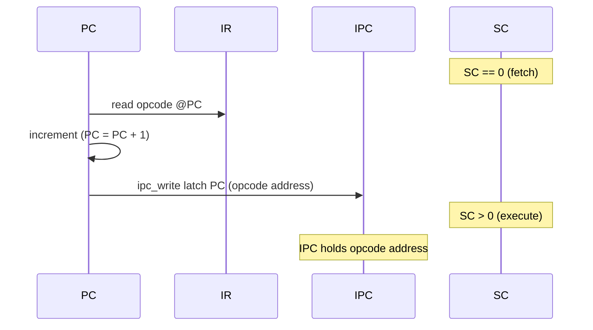
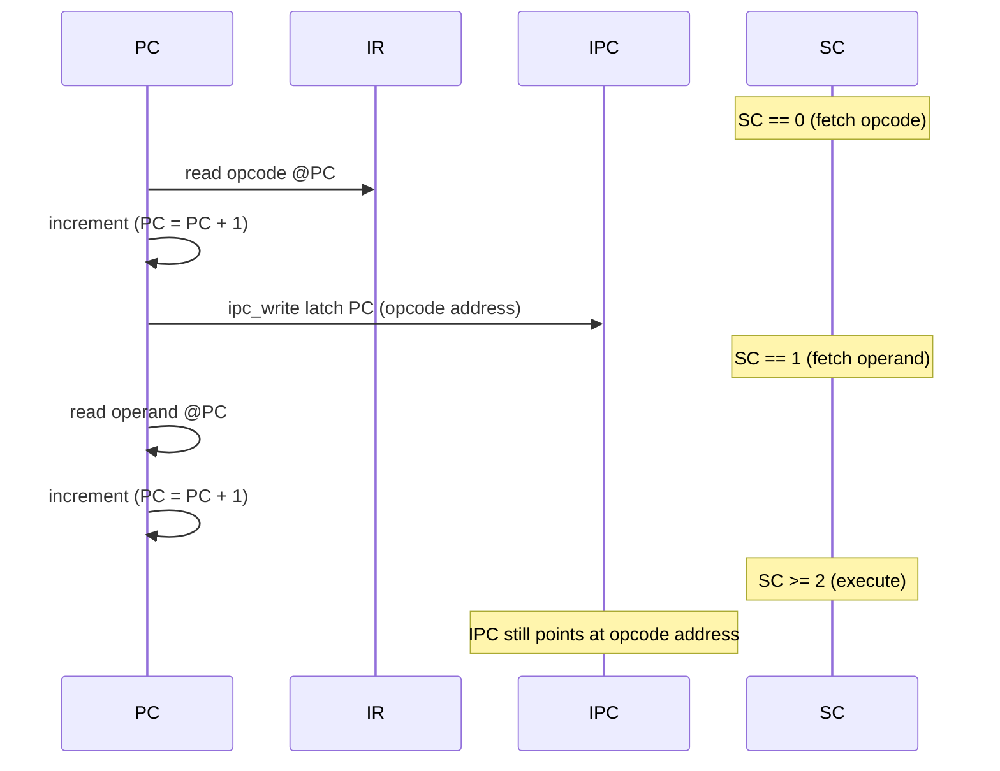
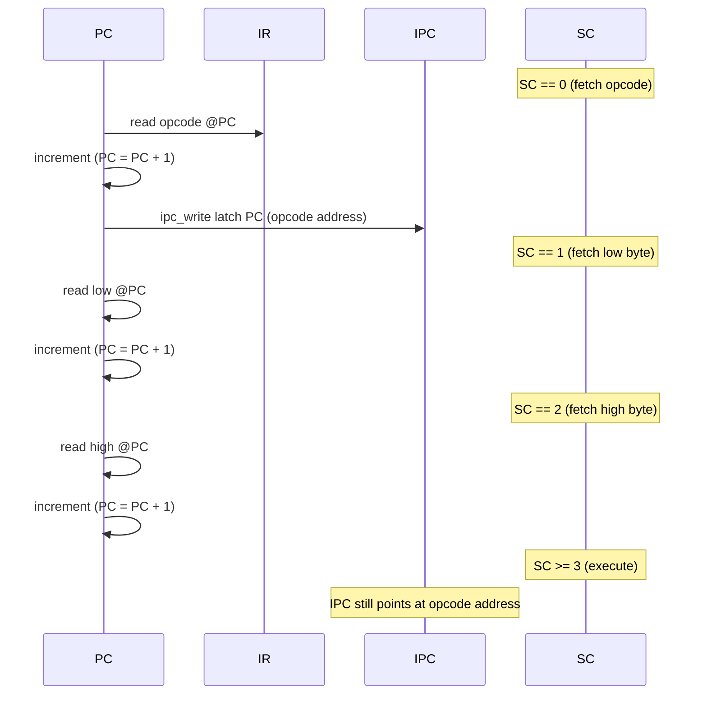

# Debugging Support (Assembler + Sim)

## Goals

- Make debugging first-class for ASM programs and tests.
- Map sim state back to source file/line information.
- Capture enough execution history to explain failures.

## Problem Statement

The simulator and tests currently report only pass/fail. When a test crashes
or halts unexpectedly, there is no symbol or source context to explain what
happened.

## Scope

- Assembler debug symbol output.
- Simulator loading and using symbols.
- Test failure output with full CPU state.
- Trace buffer and diagnostic dump.

## Proposed Work

### Subprojects

#### 1) Assembler Debug Sidecar (JSON)
**Scope**
- Emit a JSON sidecar file alongside the cartridge binary.
- Keep the cartridge format lightweight for release builds.
- Store the JSON schema alongside the assembler (e.g. `assembler/debug_schema.json`).

**Data model (draft)**
- `version`: schema version string.
- `source_root`: path of the primary ASM file (used for relative mapping).
- `source_files`: list of source file paths (relative to `source_root`).
- `symbols`: map of label -> address.
- `pc_to_source`: map of address -> {file, line}.
- `org_map`: optional segments for `.org` ranges.
- Use `.include` as the canonical source-include directive for future work.

**Milestones**
- M0: JSON schema defined + validator + tests (Python checker in CI).
- M1: Assembler emits JSON for existing ASM tests (versioned).

#### 2) Simulator Debug Loader
**Scope**
- Load JSON debug sidecar.
- Provide a lookup API: address -> source, symbol -> address.

**Milestones**
- M0: Loader validates schema + errors gracefully.
- M1: PC -> file/line lookup for current instruction.

#### PC-to-Source Mapping Timing (Design Notes)
**Problem**
- Using the live PC to map to source is ambiguous once the opcode fetch
  increments PC. During the body of an instruction, PC points at the next
  instruction (implied addressing), or past operand bytes (immediate/absolute).
- Relying on PC and addressing mode alone loses the exact "instruction start"
  for trace and diagnostics.

**Proposed hardware-ish solution**
- Add a latched "instruction PC" register (IPC) that captures the instruction
  start address at the beginning of each instruction.
- IPC is loaded at the same moment the opcode is fetched (when SC == 0 and IR
  is written). This avoids timing overhead because it is a parallel latch that
  reuses the existing fetch stage.
- During the rest of the instruction, IPC remains stable even as PC advances
  to operand bytes or the next instruction.
- Debug/tracing uses IPC (preferred), falling back to PC only when IPC is
  unavailable (bootstrap, reset, or non-instruction cycles).
- Because the microcode validators enforce a uniform fetch preamble, IPC can
  be latched there without per-instruction special cases.

**Control implications**
- Add a control line `ipc_latch` (auto-reset) that latches PC into IPC.
- Assert `ipc_latch` in the first fetch preamble step (PC -> address bus).
- This guarantees the latched address corresponds to the opcode byte that
  defines the instruction and is stable through the entire microcode sequence.
- IPC update does not interfere with PC increment or decode timing.

**End-of-instruction detection**
- No explicit "end" signal needed if IPC is latched at the next instruction's
  fetch stage. The end of the current instruction is already implied by the
  SC reset / fetch preamble.
- If a future design adds multi-cycle fetch or microcode branches, IPC still
  updates only on the next opcode fetch, keeping the mapping consistent.

**Fallback approach (less accurate)**
- Round down PC by operand width during execution. This is fragile because it
  depends on knowing the current instruction's addressing mode and does not
  handle implied/increment side effects cleanly.

**Other potential solutions**
- **IR-based lookup:** Use the opcode in IR plus the last fetched PC (or a
  decoder-maintained "current opcode address") to map to source. This still
  needs a stable opcode address source, but could be implemented as a pure
  sim-level model without extra HDL signals.
- **PC history FIFO:** Track a tiny FIFO of recent PCs during fetch. The active
  instruction picks the oldest entry in the FIFO until SC resets. This is a
  lighter-weight hardware-ish alternative to a dedicated IPC register.
- **Microcode-provided instruction start:** Extend microcode to emit a control
  that tags the "instruction start" cycle. This moves the decision into the
  control ROM but risks divergence if microcode changes or is optimized.
- **Decode-stage capture in sim only:** In the simulator, capture the PC when
  IR is written (SC == 0), and hold it in a sim-only field. This yields the
  same behavior as IPC without HDL changes, but sim/HDL divergence is a risk.
- **Sidecar execution map:** Emit a contiguous map of ROM offset -> source
  line, and use the opcode fetch address derived from bus activity (if
  observable) to index the map. This relies on being able to detect the opcode
  fetch cycle from the outside.

**Timing diagrams**

Implied addressing (opcode only):

Immediate addressing (opcode + 1 byte):

Absolute addressing (opcode + 2 bytes):

#### 3) Failure Diagnostics (Verbose State Dump)
**Scope**
- On unexpected halt/crash, dump full programmer-visible state when a debug
  sidecar is provided (debug mode).
- Include source location if debug info is present.

**State to include**
- Registers: A, X, PC, SR flags (Z/N/C/V/etc.).
- IR, SC (if exposed), and memory-mapped state if relevant.
- Current bus values if meaningful to end users.

**Milestones**
- M0: Basic register/flag dump on failure (debug mode only).
- M1: Source location + symbol context in failure output.

#### 4) Trace Buffer (Rotating History)
**Scope**
- Ring buffer of last N instructions and state snapshots.
- Emit trace on failure.

**Milestones**
- M0: Store last N PC/IR + minimal state.
- M1: Include symbolized source locations in trace.

#### 5) Test Harness Integration
**Scope**
- Ensure ASM integration tests can load debug sidecar via `irata2_run`.
- Improve test output formatting for CI logs.

**Milestones**
- M0: `irata2_run` accepts `--debug` flag for sidecar.
- M1: Tests assert debug output presence on failure paths (debug mode).

1. **Assembler debug output**
   - Emit a sidecar debug file with:
     - Source file + line for each instruction.
     - Symbol table (labels -> address).
     - Optional section metadata (org boundaries).
   - Decide on a compact, stable format (JSON or YAML).

2. **Sim symbol loading**
   - Load debug info alongside the cartridge binary.
   - Provide API to map PC -> source location and symbol names.

3. **Failure diagnostics**
   - When a test fails (CRS or unexpected HLT), print:
     - Full register set and status flags.
     - Current PC/IR/SC and bus values.
     - Source location for PC (if available).

4. **Trace buffer**
   - Ring buffer of last N instructions and key state snapshots.
   - Dump on failure with symbolized addresses.

5. **Test harness integration**
   - Ensure tests consume debug symbols by default.
   - Add tests that validate source mapping and trace output.

## Milestones

- M0: Assembler emits a debug sidecar file.
- M1: Sim loads debug info and maps PC -> source line.
- M2: Failures print symbolized state + trace buffer.

## Open Questions

- None yet.
