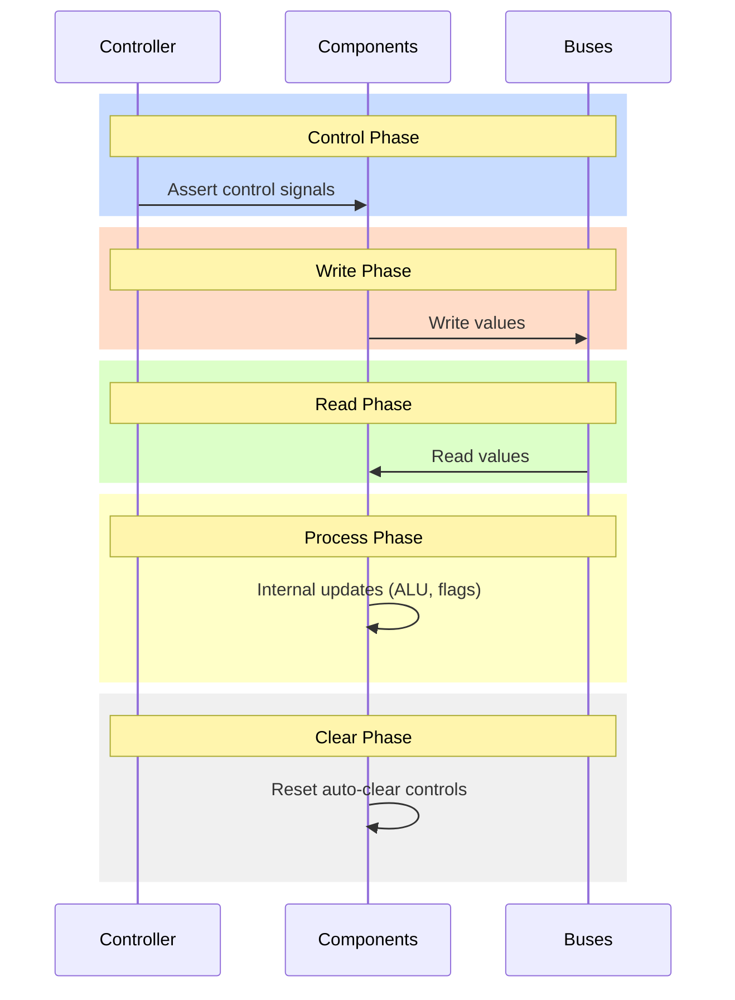

# Sim Module - Runtime Simulator

The simulator module adds runtime execution capabilities to the HDL structure.

## Overview

While the HDL module describes the **structure** of the CPU, the sim module adds:
- Mutable runtime state (register values, bus contents)
- Five-phase tick orchestration
- Phase-aware control signal enforcement

The sim module takes an HDL Cpu as input and creates a running simulator that can execute instructions cycle-by-cycle.

## Five-Phase Tick Model

Each CPU clock cycle consists of five phases:

1. **Control**: Controller reads microcode and asserts control signals
2. **Write**: Components write their values to buses
3. **Read**: Components read values from buses
4. **Process**: Internal updates (ALU operations, status flag updates)
5. **Clear**: Reset auto-clear controls for next cycle



```cpp
sim::Cpu cpu(hdl_cpu);
cpu.Tick();  // Executes all five phases
```

## Key Concepts

### Phase Enforcement

Controls are only valid during their designated phase:
- Write controls: Only active during Write phase
- Read controls: Only active during Read phase
- Process controls: Only active during Process phase

Attempting to access a control in the wrong phase raises an error.

### Single Writer Enforcement

Each bus can only have one writer per tick. The simulator validates this at runtime.

### Auto-Reset vs Latched Controls

- **Auto-reset controls** clear after each tick (most control signals)
- **Latched controls** maintain their value until explicitly changed

## Current Status

The sim module currently provides:
- Basic Cpu class with tick orchestration
- Phase tracking
- Cycle counting
- Halt/resume functionality
- Core component types (controls, buses, registers, counters)
- Controller with IR/SC and control assertion from microcode programs
- Memory model with ROM/RAM mapping and MAR
- Status views for SR bits plus a status analyzer register for Z/N
- `irata2_run` CLI for executing cartridges
- End-to-end `.asm` test coverage (HLT/NOP/CRS) via `ctest`

Future additions:
- Expanded instruction coverage beyond HLT/NOP/CRS
- Additional addressing modes and branching
- Status register (SR) wiring for push/pop (planned)

## Design Note: Controller Instruction Memory

The simulator controller will emulate a hardware-ish instruction memory:

- The microcode compiler outputs a **sparse** table keyed by `(opcode, step, status)` that maps to control sets.
- The controller **burns** this into a fully populated ROM image that maps the full address space of the controller (opcode/step/status) to a control word.
- The controller reads `controller.ir` (opcode), `controller.sc` (step), and status flags, encodes them into an instruction-memory address, and asserts the decoded control lines each tick.

This is the “spark” of the system: microcode becomes a physical ROM and drives the controller’s behavior directly. Encoders for status and control words will live alongside the controller as subcomponents.

## Memory Mapping Notes (MVP)

- Cartridge ROM image is `0x0000-0x7FFF`.
- The sim memory module maps cartridge ROM to CPU address space `0x8000-0xFFFF` at initialization.
- Unmapped memory reads return `0xFF` (CRS opcode) and should hard-fail tests that run off the end.

### Reference Example: pirata Controller

The `pirata` project uses a controller design worth emulating:

- **Controller owns IR + sequence counter + instruction memory**.
- **InstructionMemory.initialize(encoder)** burns the sparse microcode table into ROM chips sized for 16-bit addressing; if the table exceeds 16-bit addressing, it falls back to a sparse in-memory table.
- **Multi-ROM control words**: control words are split across multiple ROM chips, one byte per ROM, and reassembled on read.
- **Tick behavior**: `tick_control` reads `(opcode, step, statuses)`, fetches the control set from instruction memory, and asserts each control line; `tick_process` latches instruction boundaries when the sequence counter resets.

This is the exact “burn in” pattern we want: a sparse table from the compiler is turned into a ROM-backed instruction memory that drives the controller each tick.

## Usage

```cmake
target_link_libraries(your_target PRIVATE irata2::sim)
```

```cpp
#include "irata2/hdl.h"
#include "irata2/sim.h"

hdl::Cpu hdl;
sim::Cpu cpu(hdl);

// Execute cycles
while (!cpu.halted()) {
  cpu.Tick();
}

std::cout << "Executed " << cpu.cycle_count() << " cycles\n";
```

## Debugging CLI

The `irata2_run` helper can load debug sidecars and emit a failure dump:

```bash
irata2_run --debug program.json --trace-depth 64 program.bin
```

On unexpected crash/halt or timeout, the simulator prints a register/bus dump
plus a trace of recent instructions. Use `--expect-crash` to mark a crash as
expected or `--max-cycles N` to force a timeout.

## Logging

The simulator uses structured logging to provide visibility into execution:

### Log Events

- **sim.start**: Logged at simulation start with cartridge path, entry PC, trace depth, and debug symbols path
- **sim.halt**: Logged on normal halt with cycle count and instruction address
- **sim.crash**: Logged on crash with cycle count and instruction address
- **sim.timeout**: Logged when max cycles exceeded with cycle count and instruction address
- **sim.dump**: Logged on failure with full debug dump including CPU state, registers, buses, and trace buffer

### Log Level Configuration

Control logging verbosity via CLI or environment variable:

```bash
# Set log level via CLI flag (overrides environment variable)
irata2_run --log-level info program.bin     # Show all lifecycle events (default)
irata2_run --log-level warning program.bin  # Show only warnings and errors
irata2_run --log-level error program.bin    # Show only errors
irata2_run --log-level debug program.bin    # Show debug messages (verbose)

# Set log level via environment variable
export IRATA2_LOG_LEVEL=info
irata2_run program.bin

# Suppress logs in tests
IRATA2_LOG_LEVEL=error ctest --test-dir build
```

### Log Output Examples

**Normal execution:**
```
I0112 03:14:13.671054 run.cpp:94] sim.start: cartridge=program.bin, entry_pc=0x8000, trace_depth=0, debug_symbols=none
I0112 03:14:13.671449 run.cpp:125] sim.halt: cycle_count=42, instruction_address=0x8010
```

**Failure with debug dump:**
```
I0112 03:15:51.663621 run.cpp:94] sim.start: cartridge=program.bin, entry_pc=0x8000, trace_depth=64, debug_symbols=program.json
I0112 03:15:51.663984 run.cpp:122] sim.crash: cycle_count=4, instruction_address=0x8000
I0112 03:15:51.664040 run.cpp:138] sim.dump:
Debug dump (crash)
cycle: 4
instruction: 0x8000 program.asm:1:1 crs
pc: 0x8001 ipc: 0x8000 ir: 0xff sc: 0x00
a: 0x00 x: 0x00 sr: 0x02 flags: N=0 V=0 U=0 B=0 D=0 I=0 Z=1 C=0
buses: data=-- address=--
trace (1 entries):
  [0] cycle=0 addr=0x8000 ir=0xff pc=0x8000 sc=0x01 a=0x00 x=0x00 sr=0x02 program.asm:1:1 crs
```

## Files

- `component.h` - Base classes for sim components
- `cpu.h` / `cpu.cpp` - Root simulator with tick orchestration
